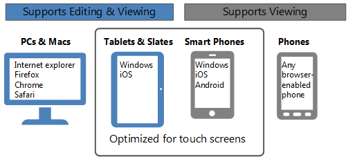

# Office Online Server overview
 **Summary:** Learn about and how it provides browser-based Office functionality to supported hosts.
 **Audience**: IT Professionals
  
    
    

 delivers browser-based versions of , , , and . A single farm can support users who access files through , , shared folders, and web sites.
> [!IMPORTANT]
> **Are you looking for help with on your desktop or mobile device?** You can find this information by searching for "" on [Office Support](https://go.microsoft.com/fwlink/p/?LinkId=324961). 
  
    
    

In this article:
-  [About Office Online Server](office-online-server-overview.md#about)
    
  
-  [How SharePoint Server uses Office Online Server for viewing and editing Office documents](office-online-server-overview.md#sharepoint)
    
  
-  [How Exchange Server and Outlook Web App use Office Online Server for previewing Office file attachments](office-online-server-overview.md#exchange)
    
  
-  [How Office Online Server enables users to view Office files in shared folders and websites by using Online Viewers](office-online-server-overview.md#onlineviewers)
    
  

## About Office Online Server

 is an server product that provides browser-based file viewing and editing services for files. works with products and services that support WOPI, the Web app Open Platform Interface protocol. These products, known as hosts, include , and . An farm can provide services to multiple on-premises hosts, and you can scale out the farm from one server to multiple servers as your organization's needs grow. requires dedicated servers that run no other server applications, however, you can install on virtual machines if needed.
  
    
    
With , users can also view or edit files that are stored outside , such as those in shared folders or other web sites. This functionality is provided by a feature known as Online Viewers.
  
    
    

## How SharePoint Server uses Office Online Server for viewing and editing Office documents

When used with , provides , , , and . Users can view and, in some cases, edit documents in SharePoint libraries by using a supported web browser on computers and on many mobile devices, such as Windows Phones, iPhones, iPads, and Windows tablets.
  
    
    
Note that only works with SharePoint web applications that use claims-based authentication.
  
    
    
The following illustration summarizes the viewing and editing capabilities of on different kinds of devices.
  
    
    

**Viewing and editing capabilities of Office Web Apps**

  
    
    

  
    
    

  
    
    
 includes external data connectivity and data refresh features similar to those found in in SharePoint Server 2013. ( has been removed from SharePoint in - you use instead.)
  
    
    

## How Exchange Server and Outlook Web App use Office Online Server for previewing Office file attachments

When is configured to use , users of can preview file attachments by using , , and . These previews provide rich, full-fidelity viewing of files and any comments within them, without downloading the files before viewing them. 
  
    
    
By default, the following file types are displayed using :
  
    
    

-  documents (doc, docx, dotx, dot, dotm extensions)
    
  
-  documents (xls, xlsx, xlsm, xlm, xlsb extensions)
    
  
-  documents (ppt, pptx, pps, ppsx, potx, pot, pptm, potm, ppsm extensions)
    
  

> [!NOTE]
>  won't be used to render any attachments in IRM protected messages.
  
    
    

 integration for attachment previews is available to all customers. Exchange on-premises customers have to deploy to enable the functionality.
  
    
    
For more information about how to configure to use , see  [Office Online Server Integration](https://go.microsoft.com/fwlink/p/?LinkId=627464).
  
    
    

## How Office Online Server enables users to view Office files in shared folders and websites by using Online Viewers

Online Viewers enable users to use a web browser to view , and files that are stored on web servers or shared folders in an organization. Users can conveniently view files in a web browser without having to open a separate application. In addition, Online Viewers do not require to be installed on users' computers. Online Viewers also generate the code that is required to link or embed the URL inside a webpage. You can use Online Viewers within your Intranet, or on the Internet.
  
    
    
 provides a page at the address http:// _OfficeWebAppsServername_/op/generate.aspx that you can use to generate links to publicly available documents that have UNC or URL addresses. When a user selects a generated URL, Online Viewers enable to get the file from its location and then render it by using . The user can view the , , or file in a browser with features intact. Formatting and layout in documents are preserved, data in workbooks can be filtered and sorted, and animations play in presentations. However, be aware that Online Viewers allow users to view but not edit files, and Online Viewers can't open any files that require authentication.
  
    
    
You can find more about Online Viewers in  [Planning for Online Viewers with Office Online Server](plan-office-online-server.md#viewers).
  
    
    

> [!NOTE]
> Microsoft hosts an Internet-only facing version of Create URL on  [Office.com](http://go.microsoft.com/fwlink/?LinkId=256548&amp;clcid=0x409). 
  
    
    

## See also

#### 

  
    
    
 [Plan Office Online Server](plan-office-online-server.md)
  
    
    
 [Deploy Office Online Server](deploy-office-online-server.md)
